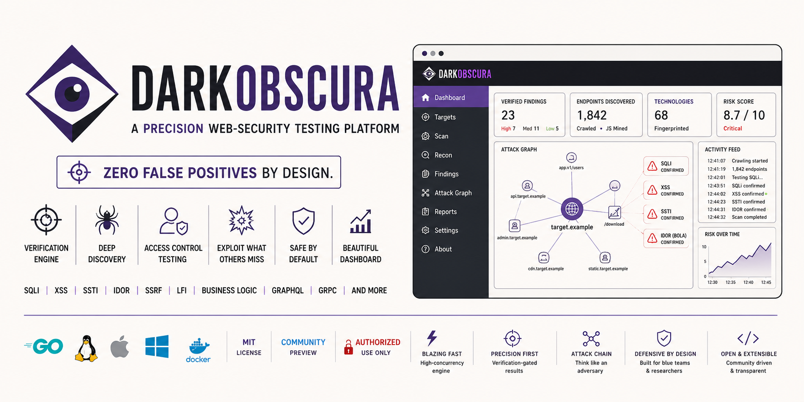
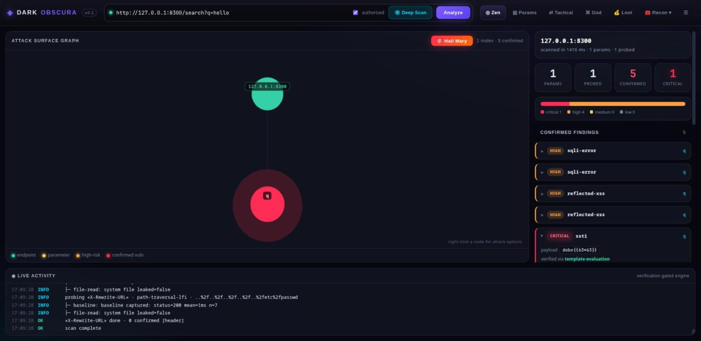
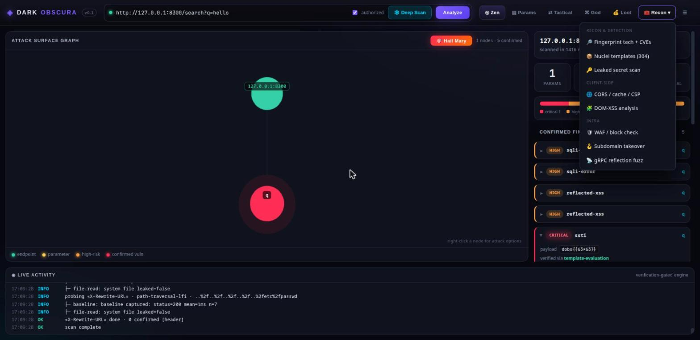
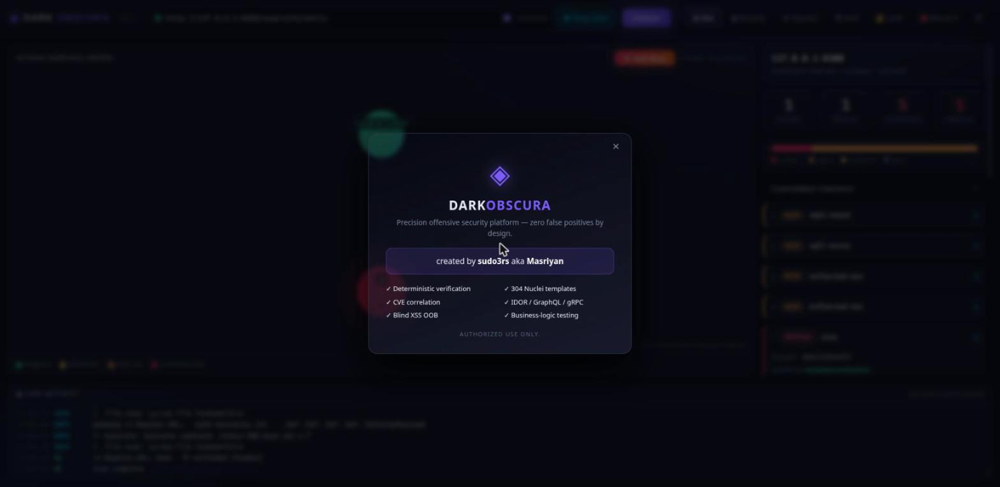

<div align="center">



DarkObscura is an automated offensive-security scanner that only reports what it can
*prove*. Every finding labelled `confirmed` is backed by deterministic verification
(statistical timing analysis, out-of-band callbacks, structural diffing, or a
cryptographic/oracle match) — not a heuristic guess.

[](https://go.dev)
[](LICENSE)
[](#)
[](#-legal--ethics)

</div>

> ⚠️ **AUTHORIZED USE ONLY.** DarkObscura is for testing systems you **own** or have
> **explicit written permission** to assess. Unauthorized scanning is illegal in most
> jurisdictions. See [Legal & Ethics](#-legal--ethics).

---

## ✨ Why DarkObscura

Traditional scanners flood you with "possible" issues and leave you to triage the
noise. DarkObscura is built around a single idea: **a finding is only reported when it
is mathematically or contextually verified.** Anything softer is clearly labelled
`possible`/`likely`, never `confirmed`.

- 🎯 **Zero false positives** — a four-stage verification pipeline (baseline →
  differential → time-series → out-of-band canary) gates every finding.
- 🧠 **Bugs other scanners miss** — deterministic IDOR/BOLA, business-logic
  state-machine testing, attack-chain reasoning, persistent blind-XSS, gRPC fuzzing.
- 🖥️ **Self-contained** — a single Go binary with an embedded WebGL dashboard. No JVM,
  no runtime dependencies, no npm at runtime.
- 🔒 **Safe by default** — built-in SSRF/scope guard, bearer-token API auth, and an
  explicit `--i-have-authorization` gate.

DarkObscura is **not** a replacement for an interactive proxy suite (Burp/Caido/ZAP);
it is a complementary, opinionated automated scanner. See [FEATURES](docs/FEATURES.md)
for an honest comparison.

---

## 📸 Screenshots

**Attack-surface dashboard** — verified findings, live WebGL attack graph, and a
streaming activity console (here: a scan confirming SQLi, reflected XSS, and SSTI).



| Recon & detection menu | About |
|---|---|
|  |  |

---

## 🚀 Quick start

### Requirements
- Go **1.26+** (to build from source)
- Linux / macOS / Windows

### Build

```bash
git clone https://github.com/security-life-org/DarkObscura.git
cd DarkObscura
make build          # or: go build -o bin/dobscura ./cmd/cli
```

### Launch the desktop GUI

```bash
./bin/dobscura --gui
# for local testing against 127.0.0.1 targets:
./bin/dobscura --gui --allow-private --no-auth
```

Open the printed URL, enter a target, tick **authorized**, and press **Analyze** or
**Deep Scan**. Use **🧰 Recon** and the **☰** menu for the rest.

### Headless CLI

```bash
# scan a single URL (verification-gated)
./bin/dobscura scan "https://target.example/search?q=1" --i-have-authorization

# fingerprint tech + correlate CVEs
./bin/dobscura fingerprint https://target.example --i-have-authorization
./bin/dobscura cve https://target.example --i-have-authorization

# run the bundled 300+ official Nuclei templates
./bin/dobscura templates https://target.example --i-have-authorization
```

Full command reference: **[docs/USAGE.md](docs/USAGE.md)**.

---

## 🧩 Feature highlights

| Area | What it does |
|---|---|
| **Verification engine** | Time-based SQLi (z-score), reflected/stored XSS, SSTI, LFI, open-redirect, SSRF/RCE/XXE (OOB canary), error-based SQLi, structural differential |
| **Discovery** | Same-origin crawler (HTML + JS-mined endpoints, robots/sitemap), OpenAPI import, dynamic surface harvester |
| **Access control** | IDOR/BOLA multi-identity engine, business-logic state-machine testing |
| **Recon** | CMS/framework/server/CDN fingerprinting (confidence-graded), version→CVE correlation, secret & entropy scanning, subdomain takeover |
| **APIs** | GraphQL (introspection, alias/batch abuse, dangerous mutations), gRPC reflection fuzzing, JWT attacks |
| **Client-side** | CORS / cache-poisoning / CSP checks, DOM-XSS source→sink analysis |
| **Ops** | WAF/block detection & live signal, WAF-evasion payload mutation, attack-chain orchestration, SARIF + HTML reporting, CI gate |

See **[docs/FEATURES.md](docs/FEATURES.md)** for the complete list.

---

## 🏗️ Architecture

A single Go module with clean package boundaries: a MITM proxy, a concurrency engine,
a verification-gated fuzzer, and an embedded WebGL UI. Read
**[docs/ARCHITECTURE.md](docs/ARCHITECTURE.md)**.

```
cmd/cli          → dobscura CLI + embedded GUI launcher
internal/proxy   → MITM HTTP/1.1+2 proxy, TLS intercept
internal/exploit → verification pipeline + stateful fuzzer + OOB canary
internal/gui     → embedded dashboard (Go + vanilla JS + Three.js)
internal/*       → crawl, fingerprint, cve, graphql, waf, dom, secrets, …
pkg/*            → diff, timeseries, certgen, netutil
```

---

## 🐳 Docker

```bash
docker compose up --build
# binds to 127.0.0.1 only, read-only rootfs, all caps dropped
```

---

## 🤝 Contributing

This is a community project — contributions are welcome! Please read
**[CONTRIBUTING.md](CONTRIBUTING.md)** and our **[CODE_OF_CONDUCT.md](CODE_OF_CONDUCT.md)**.
Found a security issue in DarkObscura itself? See **[SECURITY.md](SECURITY.md)**.

---

## ⚖️ Legal & Ethics

DarkObscura is a **defensive-security and authorized-testing** tool. By using it you
agree to test **only** systems you own or are explicitly authorized to assess.

- Never scan third-party systems without written permission.
- The maintainers accept **no liability** for misuse.
- The tool ships gated behind `--i-have-authorization` and a scope/SSRF guard for a
  reason — keep them on.

---

## 📄 License

Released under the [MIT License](LICENSE) © security-life-org.
